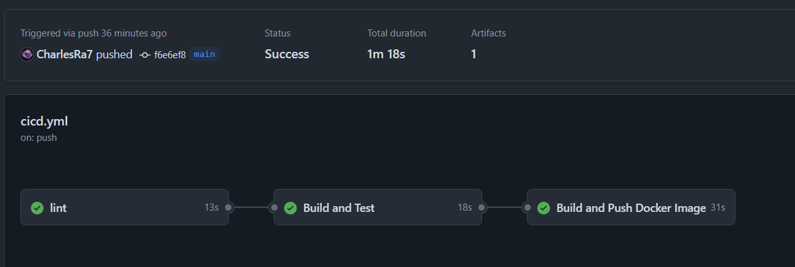

# LOG430-Lab0

## Description du projet

Ce projet est une application web simple développée avec le framework Spring Boot. Elle expose une API REST accessible sur le port localhost:8080 avec la route "/" qui retourne le message "Hello World!" au format texte.

### Architecture

L’application suit une architecture basée sur le modèle MVC (Modèle-Vue-Contrôleur) avec Spring Boot. Cependant, il n'y a pas encore les couches Modèle et Vue afin de simplifier le projet.

### Structure
```
LOG430-Labs/
├── README.md
├── pom.xml
├── docker-compose.yml
├── Dockerfile
├── .gitignore
└── src
    ├── main
    │   ├── java
    │   │   └── ets
    │   │       └── log430
    │   │           └── lab
    │   │               ├── controllers
    │   │               │    └── HelloController.java
    │   │               └── LabApplication.java
    │   └── resources
    │       └── application.properties
    └── test
        └── java
            └── ets
                └── log430
                    └── lab
                        └── LabApplicationTest.java
```

### Instructions 

**Cloner le projet**

1. Se rendre dans le dossier où on désire cloner le projet
2. Exécuter la commande suivante : 
    ```
    git clone https://github.com/CharlesRa7/LOG430-Labs.git
    ```

**Build et Exécution**

1. Après avoir cloner le projet, se rendre à la racine du projet avec la commande suivante : 
    ```
    cd LOG430-Labs
    ```
2. Exécuter la commande suivante à la racine du projet : 
    ```
    ./mvnw spring-boot:run
    ```
3. Après le build et l'exécution, l'application est accessible sur localhost:8080 et on peut recevoir la réponse "Hello World!" de l'API REST en ouvrant un terminal différent et en exécutant la commande suivante : 
    ```
    curl localhost:8080
    ```

## Fonctionnement du CI/CD

### Lint

Cette étape exécute la fonction [check](https://maven.apache.org/plugins/maven-checkstyle-plugin/check-mojo.html) du plugin Checkstyle pour effectuer des vérifications sur le format du code avec ces [règles](https://github.com/checkstyle/checkstyle/blob/f96a1ef0332d7adce4c237219cffb1962654075c/src/main/resources/google_checks.xml).

### Build and Test

Cette étape exécute la commande suivante : `mvn test`. Cette commande lance le build de l'application ainsi que les tests unitaires.

### Build and Push Docker Image

Cette étape build l'image Docker à l'aide du Dockerfile, se connecte à Docker Hub à l'aide d'une clé SSH et ensuite push l'image dans le répertoire sur Docker Hub. 

### CI/CD en succès



## Choix techniques

### Framework 

J'ai décidé d'utiliser le framework Spring Boot pour mon application car j'ai déjà de l'expérience avec celui-ci. De plus, il est facile et rapide de générer une structure de projet grâce au [Spring Initializr](https://start.spring.io/).

### CI/CD

J'ai décidé d'utiliser Github Actions car comme pour le framework, j'ai déjà de l'expérience en création de pipeline avec cette technologie et j'utilise Github pour mon dépôt de code. 
